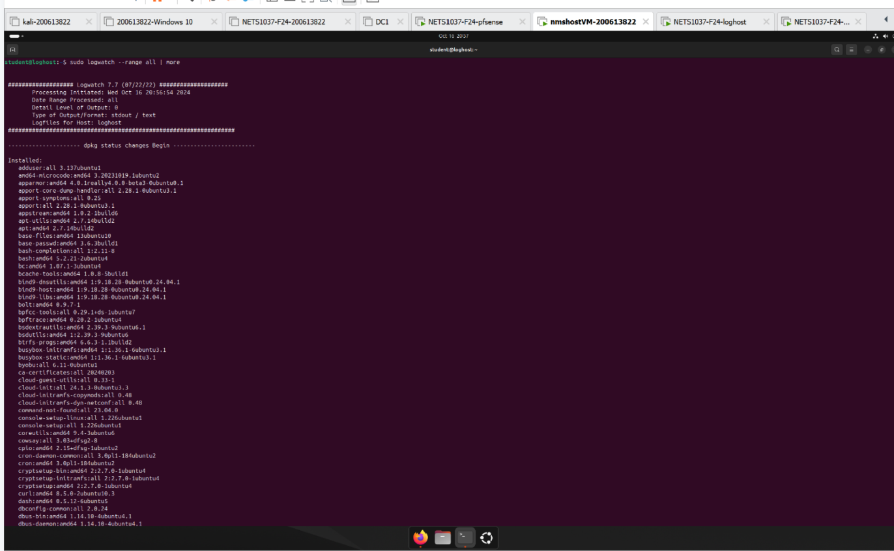

# Lab--Log-Analysis-Advanced-Log-Management-Analysis-and-Reporting-Solution

## Project Description

Lab- Log Analysis is an advanced lab project designed to develop skills in configuring networked virtual environments for log collection and analysis. The primary focus is on setting up and managing a robust logging infrastructure that can capture, store, and analyze log data from multiple sources within a virtual network. Participants will set up virtual machines (VMs) with specialized roles, such as a loghost to receive and process logs, a router for traffic management, and client machines that generate log data. This lab involves configuring syslog services, installing and setting up log analysis tools like fwanalog and logwatch, and using cron jobs to automate log data collection and reporting. The final goal is to ensure logs are properly processed and accessible for analysis, enhancing the ability to monitor network activity and respond to potential security threats effectively.

## Project Objectives

- Configure VMs to establish a network with proper IPs and routing.
- Set up a loghost to collect logs from network devices and clients.
- Install and configure log analysis tools (fwanalog, logwatch) to generate reports.
- Automate log data collection and reporting using cron jobs.
- Validate log data flow and ensure security measures like firewall rules are in place.

## Screenshots and Explanations

   

   
 

*

   

 

   

